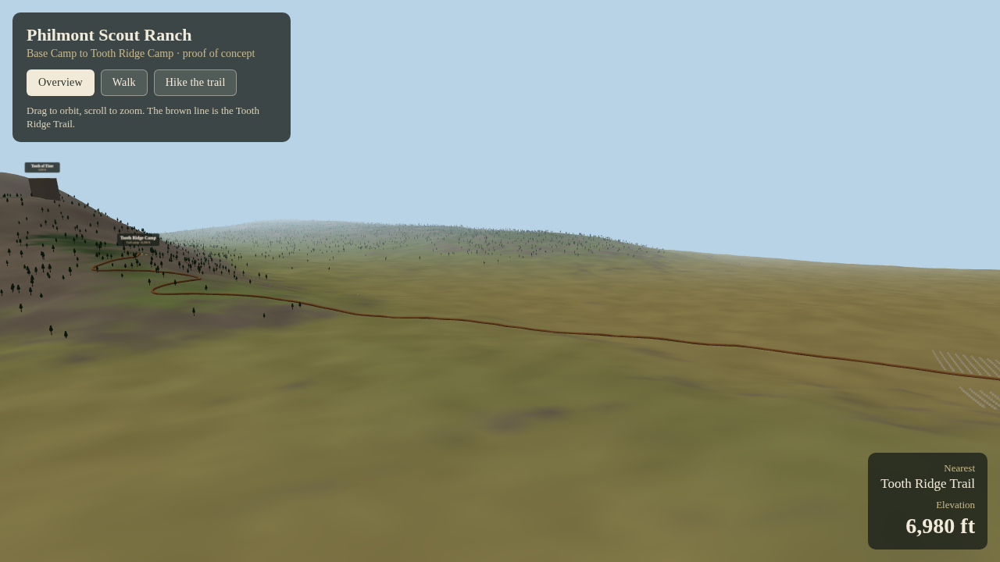

# Philmont — browser 3D proof of concept

Base Camp (Camping Headquarters) and the Tooth Ridge Trail to Tooth Ridge Camp,
built with Vite + React + Three.js.

**Live:** <https://philmont-web-production.up.railway.app>



```bash
npm install
npm run dev
```

In a GitHub Codespace, open the forwarded port that Vite prints.

- **Overview** — drag to orbit, scroll to zoom
- **Walk** — click the view to capture the mouse, W A S D to move, Shift to run, Esc to release
- **Hike the trail** — auto-hike from headquarters to Tooth Ridge Camp

Scale: 1 world unit = 10 m. Camp and landmark positions come from Philmont's
2017 UTM & Elevation Reference Guide. Terrain is a stylized heightfield
(`elevFt()` in `src/PhilmontPOC.jsx`); replacing it with a USGS 3DEP heightmap
is the next step.

## Layout

| Path | What it is |
| --- | --- |
| `src/PhilmontPOC.jsx` | Terrain, landmarks, trail, camps, controls, HUD |
| `src/trees.js` | Loads the conifer models and instances the forest |
| `public/assets/models/` | Third-party models — see `public/assets/ATTRIBUTION.md` |

## The forest

`src/trees.js` replaces the `ConeGeometry` placeholders with Kenney's low-poly
conifers. Placement is unchanged — same hash stream, same elevation-band
density, same base-camp exclusion — so the forest sits exactly where the cones
did. Two species are drawn as one `InstancedMesh` per material, so 7,000 trees
cost four draw calls (about 3.9M triangles).

Two adjustments were needed to make real models fit the scene:

- **Shading.** glTF ships `MeshStandardMaterial`, which is much darker than
  `MeshLambertMaterial` under this scene's lights with no environment map — the
  trees came out near-black. They are re-materialised as Lambert so they shade
  like everything else.
- **Colour.** The models carry Kenney's city-kit palette (mint foliage, sandy
  trunk), which reads as decorative here. Foliage and bark are recoloured to the
  cone placeholders' `#2f4a2f` and a muted ponderosa bark. Set `RECOLOUR = false`
  in `src/trees.js` to keep the originals.

## Base camp scale

The camp was originally built as though 1 unit = 1 m rather than 10 m: tents
were 15 m across and 9 m tall, spaced 24 m apart, and read as pyramids from the
ground. Camp geometry is now authored in metres and converted through `M`, so
the dimensions in the source say what they mean:

| | Now | Was |
| --- | --- | --- |
| Tent | 3.2 × 3.2 m, 2.4 m to the ridge | 15 × 15 m, 9 m |
| Tent spacing | 5.5 × 6.5 m | 24 × 26 m |
| Dining hall | 50 × 26 m, 9 m tall | 140 × 80 m, 16 m |
| Flagpole | 12 m | 30 m |
| Trail camp sign | 2.0 m | 14 m |

For reference, Walk mode puts the eye at 1.8 m, so a tent now stands just over
head height.

`tentCity()` takes a centre rather than a corner, so tightening the spacing left
Trailbound and Homebound where they already sat instead of collapsing each one
toward its origin. Their centres, and every building position, are unchanged.

The one thing still sized for the old camp is the landmark labels: the sprites
are 240 m wide and float 90 m up. That reads correctly in Overview and like a
billboard from the ground. Setting `sizeAttenuation = false` in `makeLabel()`
would give them a constant on-screen size, at the cost of changing how the
overview reads.

## Deployment

Hosted on Railway (project `philmont-game`, service `philmont-web`), which
watches the `claude/create-main-branch-mov0xn` branch and redeploys on push.
Railway runs `npm run build` and then `npm start`, which serves `dist/` on the
platform's `$PORT`. `preview.allowedHosts` is open in `vite.config.js` because
`vite preview` otherwise rejects the deploy-time host name.

Note that `main` still holds only the repository's first commit. If the branch
is ever merged into `main`, point the Railway service at `main` too, or it will
keep building the old branch.

## Assets

Models are third-party. Provenance and license evidence — including one
license that is inferred rather than confirmed — are recorded in
[`public/assets/ATTRIBUTION.md`](public/assets/ATTRIBUTION.md). Read it before
shipping anything commercially.
